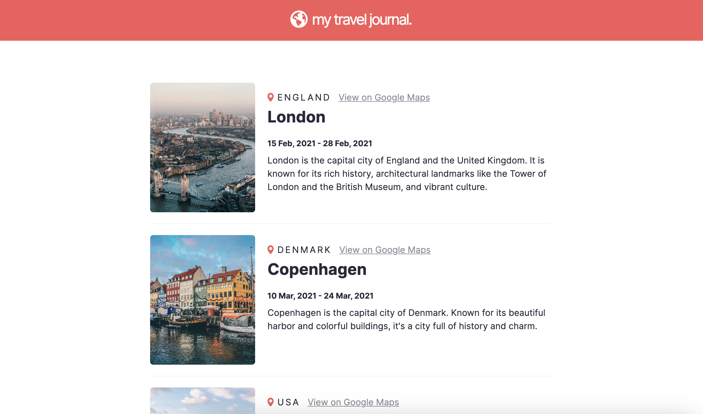

# Travel Journal 🌍

This project was created as part of the Frontend Developer Career Path by Scrimba. The design is based on a Figma file provided by Scrimba. However, the development and implementation was done entirely by me.

## Technologies

This application was developed using HTML, CSS, and React. Vite was utilized for both the development process and application bundling.

## Setup

To run this project locally, clone the repository and install the dependencies using `npm install`. Run `npm run dev` to start the development server.
